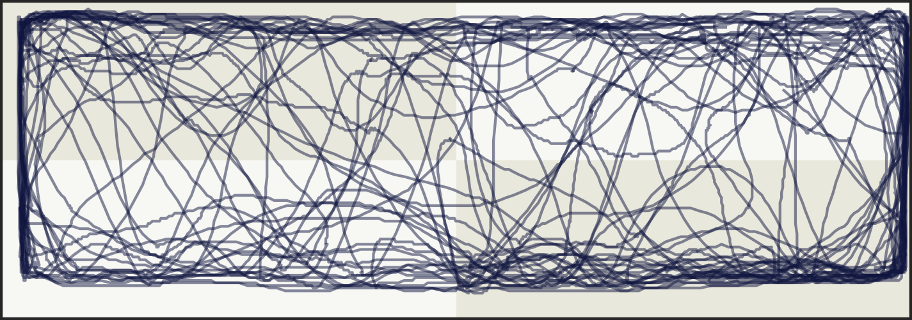

# ZantiClean

## Overview

This is the official GitHub repository for the package `ZantiClean`.
This package was designed to clean and transform behavioral data from
collected using [Zantiks LT](https://zantiks.com/products/zantiks-lt).

By making this package public, we hope to enable researchers with
limited data wrangling experience to make meaningful and important
biological inferences. The predecessor to the Zantiks system calculated
biological variables such as freezings, track length and velocity etc.
automatically, making it somewhat more user friendly. This package is an
effort to bridge this gap.

This software is still very much under development. If you notice any
bugs, have comments/queries or want additional functions that could be
widely applicable please do get in touch by opening a github issue or
emailing <e.c.phelps@exeter.ac.uk>.

## Installation

This package requires installation from github. This requires devtools.

``` r
#Check if devtools is installed, if not install it
if (!requireNamespace("devtools", quietly = TRUE)) install.packages("devtools")


#Install and load ZantiClean
devtools::install_github("EmilyPhelps/ZantiClean")
library(ZantiClean)
```

## Getting Started

The first function we will use reads in Zantiks files. The files vary in
the numbers of lines containing preamble before the actual data starts.
We want to pull out some key information from this preamble and then
read the data.

An example of important information is the line saying
`Service:SomeInformation`. This can be changed in the Zantiks code so
that the `SomeInformation` can be an allocated ID. If you have not done
this you can run `read_zancsv()` without it.

``` r
#If you have no ID 
csv <- read_zancsv("path/to/your/zantiks.csv")

#If you have an ID in the Service line
csv <- read_zancsv("path/to/your/zantiks.csv", ID="Service")

#If you have an ID in the Subject line
csv <- read_zancsv("path/to/your/zantiks.csv", ID="Subject")
```

Often you won’t have just one file to read in. In this case you can use
`read_manyzancsv()`. Here you must use an ID to help identify each
individual.

*NB: You could do some wrangling in bash to change the Service or
Subject line to add an ID after the experiment if you havent already.
e.g.* `grep "Service:" "Service:SomeInformation"`

``` r
#If you have an ID in the Service line
csvs <- read_manyzancsv("path/to/directory/containing/csvs/", ID="Service")

#If you have an ID in the Subject line
csvs <- read_manyzancsv("path/to/directory/containing/csvs/", ID="Subject")
```

Next we need to transform the data so that each line represents a single
individual. Again you can include an ID or not.

``` r
trans <- transform_csv(csvs, ID=TRUE)
```

Now we want to get some behavioural information from our data. To do
this we can use the `summary_behaviour()` function.

``` r
data <- summary_behaviour(trans)
```

This will add:

- **Track Length:** Total distance covered in all zones.

- **Velocity:** The average speed.

- **Freezing:** The number times the organism was stationary for 3
  (default) seconds or more.

- **Time in Zones:** The time spent in each zone.

What is considered freezing might be different in different species. To
change freezing time from the default 3 seconds use the `frz` option.

``` r
summary_behaviour(trans, ID=FALSE, frz=10)
```

However, sometimes you want to look at pre and post a stimulus or change
in environment. E.g. if turned the lights off after 240 seconds.To get
these estimates for before and after an event we can do

``` r
split_behaviour(data=trans, time = 240)
```

Equally you can change the freezing time here

``` r
split_behaviour(data=trans, time = 240, frz=5)
```

## Looking at XY data

Sometimes we need a quick look the overall movement of the individual.
To do this we can read in our XY coordinates.

``` r
XY <- read_zancoord("directory/containing/coordinates", "coordinatefileXY.csv")
```

This needs to then be transformed and filtered so we only have one
individual (one arena) present.

``` r
A1 <- transform_xy(XY) %>% 
              filter(arena == "A1")
```

Before we plot our individuals path, we need to get the coordinates of
the zones our arena was split into. This should be stored as a dataframe
containing the columns “zone”, “xmin”, “xmax”, “ymax”, “ymin” and
“colour”.

``` r
track_plot(XY=A1, zones=zonedata)
```

Here’s one I made earlier:

<center>

</center>

This code is pretty flexible because under the hood its just ggplot. So
you can add titles, change the theme and colour if you want to use the
raw code.

``` r
  ggplot() + 
    geom_rect(data=zones, aes(xmin=xmin, xmax=xmax,
                              ymin=ymin, ymax=ymax, fill=colour))+
    geom_path(data=XY, aes(x=X, y=Y), colour="#141F52", alpha=0.5) +
    scale_fill_manual(values=c("#E1DFD0", "#F5F4EF")) +
    scale_x_continuous(expand=c(0,0)) +
    scale_y_continuous(expand=c(0,0)) +
    theme_void()+
    theme(legend.position = "none",
          panel.border = element_rect(colour = "#333333", fill=NA, linewidth=1))
```

If you want to look at what regions are being used the most by an
individual you can use the function `density_plot()`.

``` r
density_plot(XY, track=TRUE)
```

Inclusion of the track is optional but is `TRUE` by default.

Here is a plot I made using this function.
<center>

</center>

Similarly to the one above, its just ggplot so can be altered to change
colour and theme.

``` r
 plot <- ggplot(data, aes(x=X, y=Y)) +
      stat_density_2d(aes(fill = ..density..), 
                      geom = "raster", contour = FALSE) +
      geom_path(colour="white", alpha=0.6, linewidth=0.2) +
      scale_fill_gradient(high="#3ce3df", low="#2683b5") +
      scale_x_continuous(expand = c(0, 0)) +
      scale_y_continuous(expand = c(0, 0)) +
      theme_void() +
      theme(legend.position="none")
```

## Changed your mind about experimental design?

Obviously it’s not ideal to change what you want to look at after the
experiment but the XY coordinates recorded by Zantiks allows for this.
The `allocate_zones()` function is written to allocate points to zones
and create a Zantiks .csv style dataframe from this data. This is not
for use in studies where Zones have built in differences e.g. tests of
scototaxis. However, there might be some use cases, e.g. looking for
finer scale inferences within existing zones, or changing zone size in
open field trials.

We first start by reading in a single coord file.

``` r
XY <- read_zancoord("directory/containing/coordinates", "coordinatefileXY.csv")
```

We then need to create a dataframe with our arena size. This will vary
depending on how many arenas you have per trial. For example, if we have
four arenas, the arenas might be 360 x 67.5 mm. You need to also take
into account divider size!

*Note: In a perfect world Zantiks tank size is standardised, but tank
size can vary. Make sure you account for this in arena size*

You can create this dataframe however you like but it must have the
columns below. Arenas should be named “A1” etc to match the Zantiks XY
file

``` r
arena <- paste0("A", seq(1,4))
xmin  <- c(0, 0, 0, 0)
xmax <- c(360, 360, 360, 360)
ymin <- c(0, 67.5, 135, 202.5)
ymax <- c(67.5, 135, 202.5, 270)

arena.df <- tibble(arena, xmin, xmax, ymin, ymax)
```

Now we need to create a dataframe delimiting the zones we want. Each
arena gets standardised so we only need to list the zones once and they
will be created within each arena. You can allocate any number of zones
to your arena, but the more zones the slower it will run!

``` r
# An example of 2 zones side by side
Zone <-c("Z1", "Z2")
xmin <- c(0, 0)
xmax <- c(360, 360)
ymin <- c(0, 34.1)
ymax <- c(34, 68)
zone.df <- tibble(Zone, xmin, xmax, ymin, ymax)

#Then the script to allocate zones. 
allocate_zones(XY=XY, zones = zone.df, arena = arena.df, start= 50, end=480)
```

The start time above indicates the time after calibration and after
acclimatization. The end time indicates the upper time limit for the
assay.

The `allocate_zones()` function can also account for nested designs
where zone is within the other. Here you can only allocate two zones,
inner and outer.

``` r
Zone<- c("Z_inner", "Z_outer")
xmin <- c(100, 0)
xmax <- c(250, 360)
ymin <- c(20, 0)
ymax <- c(35, 68)

zone.df <- tibble(Zone, xmin, xmax, ymin, ymax)

allocate_zones(XY=xy, zones = zone.df, arena=arena.df, start=50, end=480, file = "test", nested=TRUE)
```

I have only gone through an example with one file here. If you wanted to
scale this up to apply to all your files you could use lapply()

``` r
dir <- "path/to/directory"

files <- list.files(dir)

xy_list <- lapply(files, function(file) read_zancoord(dir, file)) # Read in XY data as a list

names(xy_list) <- files # Names each XY coordinate by the name of the file it came from 

lapply(seq_along(xy_list), function(i) {
  # Get the file name using the index 'i'
  file_name <- names(xy_list)[i]
  
  # Call allocate_zones() with file_name as the 'file' argument
  allocate_zones(XY = xy_list[[i]], 
                 zones = zone.df, 
                 arena = arena.df, 
                 start = 50, 
                 end = 480, 
                 file = file_name)
})
```
